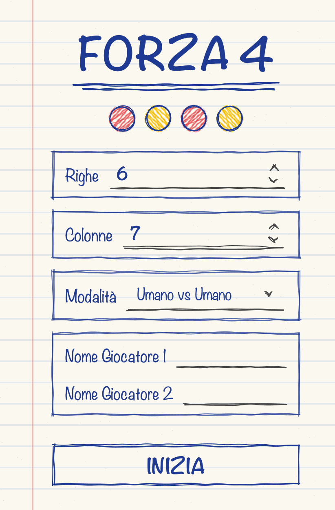
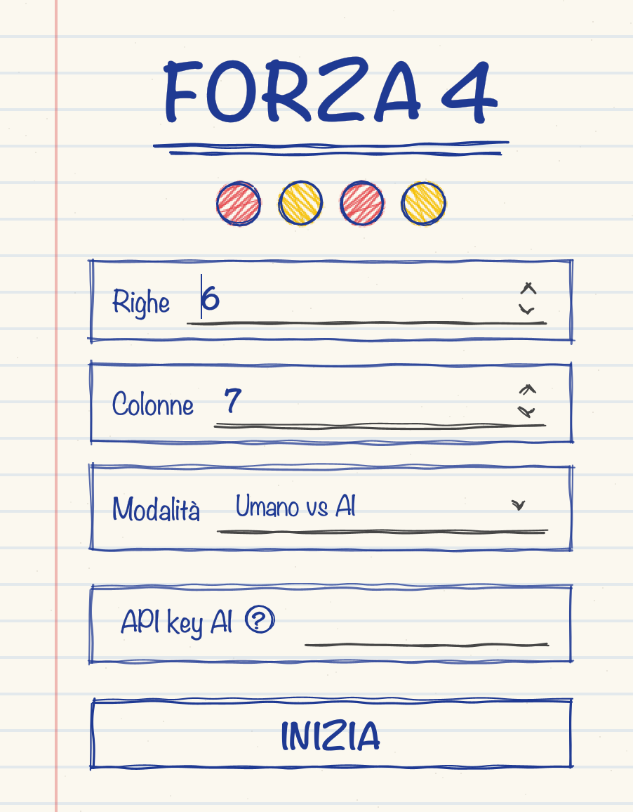
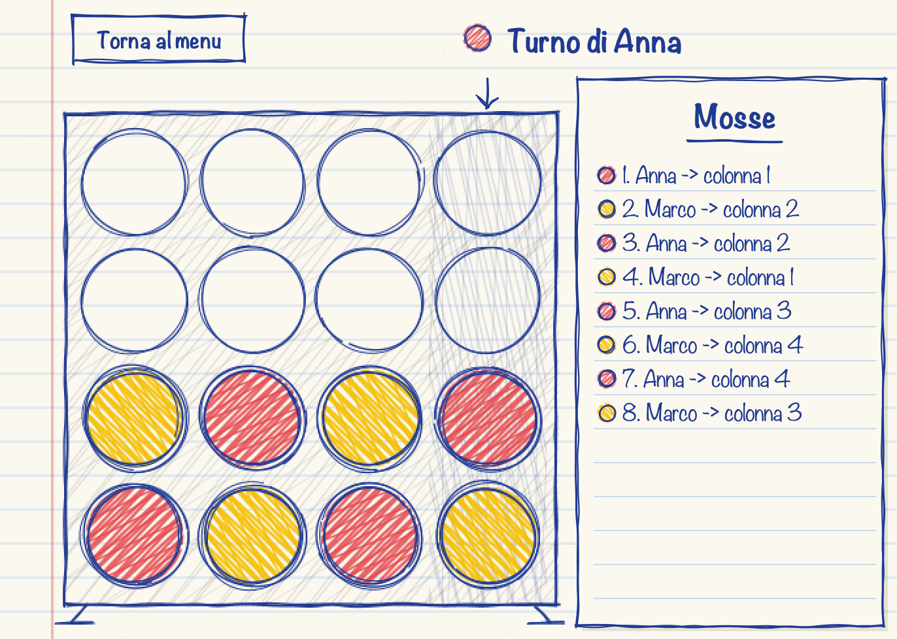
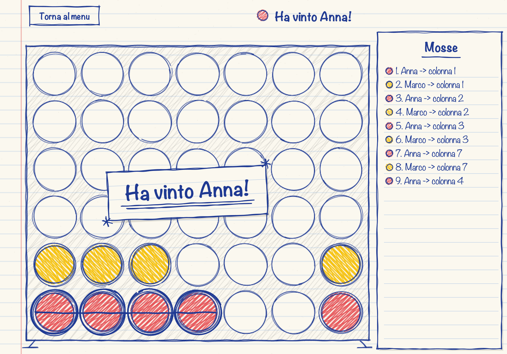
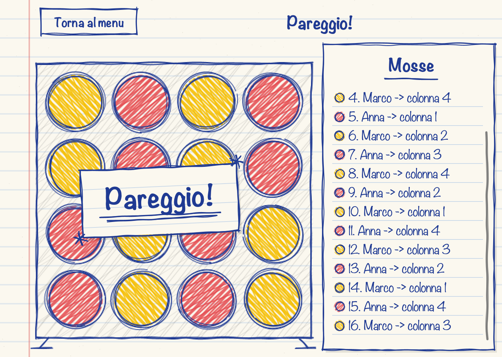

# Connect Four

Connect Four in Java with a Swing GUI, a configurable board and a computer opponent powered by **minimax with alpha-beta pruning**.

<p align="center">
  
</p>

## Features

- Board size from **4 to 8** rows and columns
- Three game modes:
  - **Human vs Human**, with custom player names
  - **Human vs Computer**: recursive minimax with alpha-beta pruning (depth 6)
  - **Human vs AI**: moves are requested from Google Gemini through its REST API
- Falling-disc animation with gravity and bounce
- Move history and highlighted winning line
- Sound effects synthesized at runtime, no audio files
- Hand-drawn notebook visual style

No external libraries: only the JDK.

> The user interface is in Italian.

## Requirements

- Java **11** or later

## Run

```bash
javac -d out src/*.java
java -cp out Main
```

### AI mode (optional)

Requires a free API key from [Google AI Studio](https://aistudio.google.com). Paste it in the start screen or set it as an environment variable:

```bash
export GEMINI_API_KEY="your-key"
```

The key is never stored in the source code. If a request fails, the game falls back to a valid move and keeps going.

## Screenshots

| Start screen | AI mode |
|---|---|
|  |  |

| 4x4 board | 8x8 board |
|---|---|
|  |  |

| Win | Draw |
|---|---|
|  |  |

More in [`docs/screenshots`](docs/screenshots).

## Project structure

```
src/
├── Main.java                 entry point
├── SchermataIniziale.java    start screen (board size, game mode)
├── MainGUI.java              game window
├── GrigliaPanel.java         board rendering and animations
├── Matita.java               hand-drawn style drawing helpers
├── Partita.java              turn loop, runs on its own thread
├── Griglia.java              board state and win detection
├── Giocatore.java            common player interface
├── GiocatoreUmanoGUI.java    human player, waits for a click (wait/notify)
├── GiocatoreUmano.java       console player (first version of the project)
├── GiocatoreComputer.java    computer player
├── IA.java                   minimax with alpha-beta pruning
├── GiocatoreAI.java          player backed by Gemini
├── ClienteAI.java            HTTP client for the Gemini API
└── Suoni.java                sound synthesis
docs/screenshots/             screenshots of the GUI
```

## How the computer plays

For every playable column, `IA` simulates the move on a copy of the board and calls `minimax` recursively, alternating the maximizing player (computer) and the minimizing player (opponent), up to depth 6. Non-terminal positions are scored by counting the 4-cell windows that favour each player. Alpha-beta pruning skips branches that cannot change the result. Wins and losses are also weighted by depth, so the computer prefers faster wins and delays losses as long as possible.

## Author

Razvon Lukian
