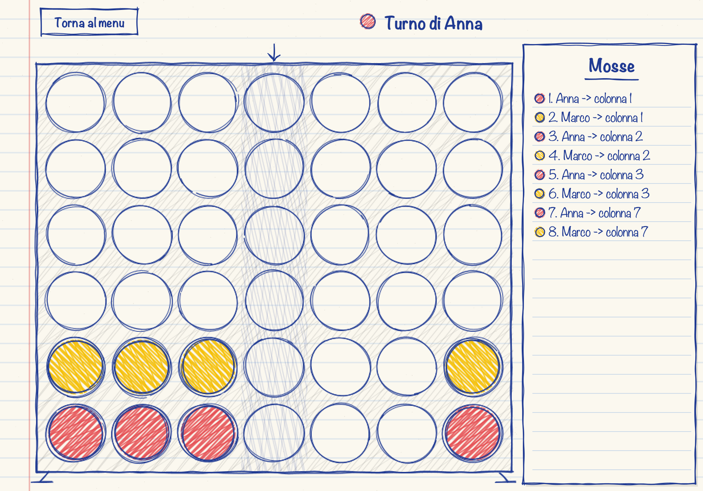
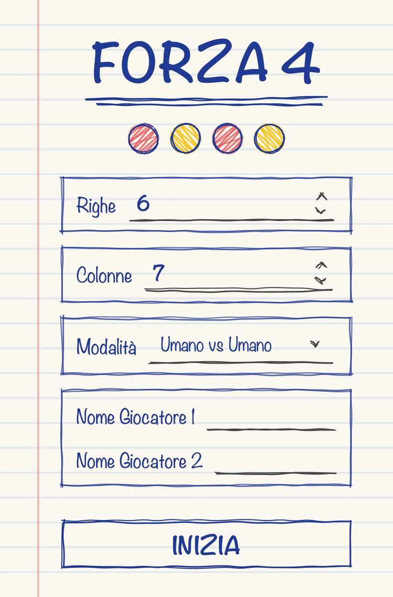
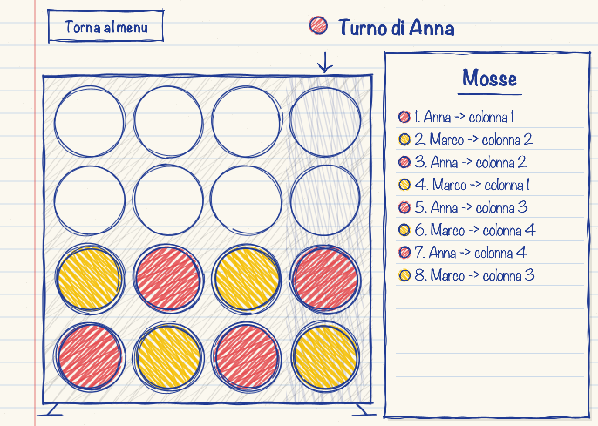
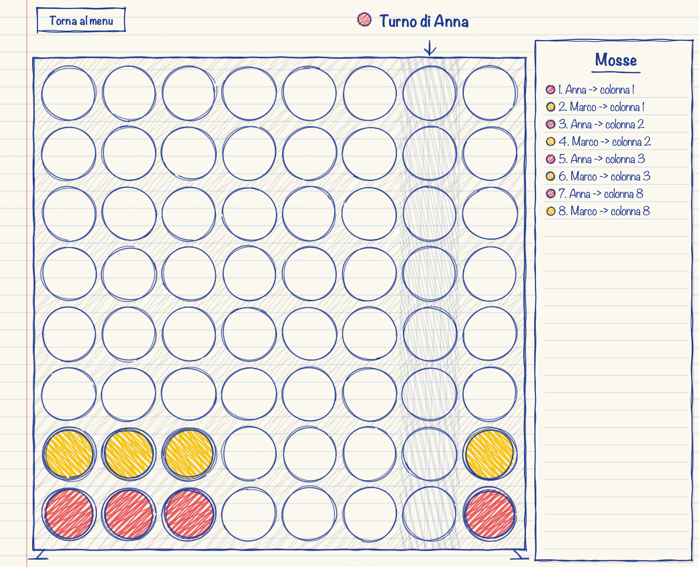
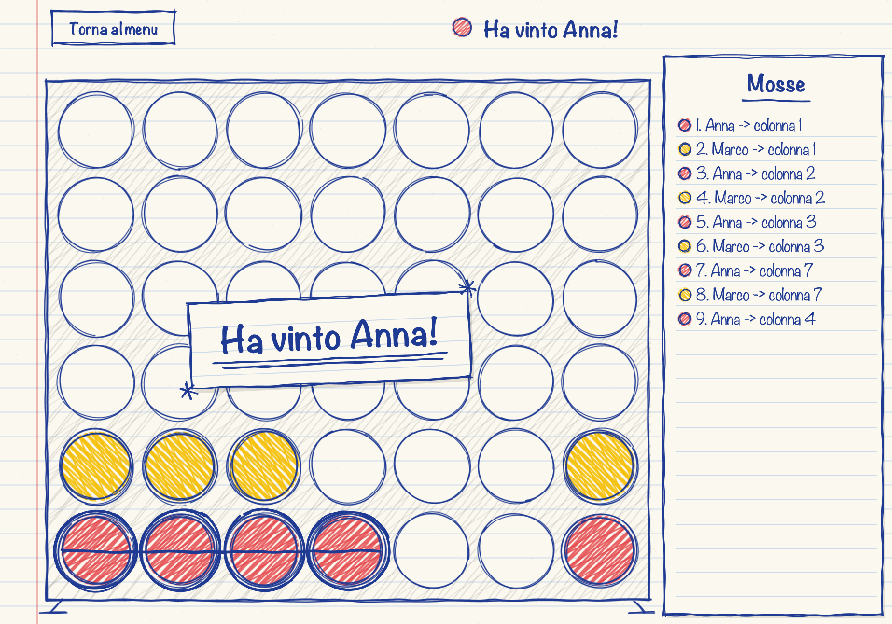
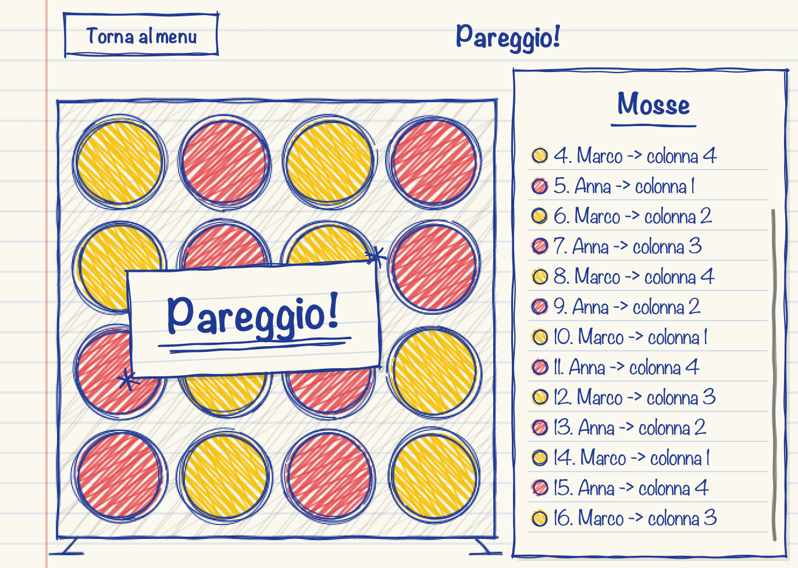

# Forza 4

Forza 4 in Java con interfaccia grafica Swing, griglia configurabile e un avversario controllato dal computer tramite l'algoritmo **Minimax con potatura alpha-beta**.

<p align="center">
  
</p>

## Funzionalità

- Griglia configurabile da **4 a 8** righe e colonne
- Tre modalità di gioco:
  - **Umano vs Umano**, con nomi personalizzabili
  - **Umano vs Computer**: Minimax ricorsivo con potatura alpha-beta (profondità 6)
  - **Umano vs AI**: la mossa viene chiesta a Gemini tramite API REST
- Animazione di caduta dei gettoni con gravità e rimbalzo
- Cronologia delle mosse, evidenziazione della combinazione vincente
- Effetti sonori generati dal programma, senza file audio
- Grafica in stile disegnato a mano su foglio a righe

Nessuna libreria esterna: solo il JDK.

## Requisiti

- Java **11** o superiore

## Avvio

```bash
javac -d out src/*.java
java -cp out Main
```

### Modalità AI (opzionale)

Serve una chiave gratuita di [Google AI Studio](https://aistudio.google.com). Si può incollare nella schermata iniziale oppure impostare come variabile d'ambiente:

```bash
export GEMINI_API_KEY="la-tua-chiave"
```

La chiave non è salvata nel codice. Se la richiesta fallisce, la partita continua con una mossa di riserva.

## Screenshot

| Schermata iniziale | Modalità AI |
|---|---|
|  |  |

| Partita 4x4 | Partita 8x8 |
|---|---|
|  |  |

| Vittoria | Pareggio |
|---|---|
|  |  |

Tutti gli screenshot sono in [`docs/screenshots`](docs/screenshots).

## Struttura del progetto

```
src/
├── Main.java                 punto di ingresso
├── SchermataIniziale.java    finestra di configurazione
├── MainGUI.java              finestra di gioco
├── GrigliaPanel.java         disegno del tabellone e animazioni
├── Matita.java               funzioni di disegno in stile "a mano"
├── Partita.java              gestione dei turni (thread separato dalla GUI)
├── Griglia.java              stato della griglia e controllo vittoria
├── Giocatore.java            interfaccia comune ai giocatori
├── GiocatoreUmanoGUI.java    attende il clic (wait/notify)
├── GiocatoreUmano.java       versione da console (prima versione del progetto)
├── GiocatoreComputer.java    giocatore che usa l'IA
├── IA.java                   Minimax con potatura alpha-beta
├── GiocatoreAI.java          giocatore che interroga Gemini
├── ClienteAI.java            chiamata HTTP all'API di Gemini
└── Suoni.java                sintesi degli effetti sonori
relazione/                    relazione scolastica (PDF) e script per generarla
docs/screenshots/             screenshot dell'interfaccia
```

## Come funziona l'IA

Per ogni colonna giocabile, `IA` simula la mossa su una copia della griglia e richiama ricorsivamente `minimax`, alternando il turno che massimizza (computer) e quello che minimizza (avversario), fino a profondità 6. Le posizioni non finali vengono valutate contando le "finestre" di 4 celle favorevoli a ciascun giocatore. La potatura alpha-beta scarta i rami che non possono cambiare la decisione. Vittorie e sconfitte sono pesate anche in base alla profondità, così il computer preferisce vincere subito e rimandare il più possibile una sconfitta.

## Autore

Razvon Lukian, classe 5D
